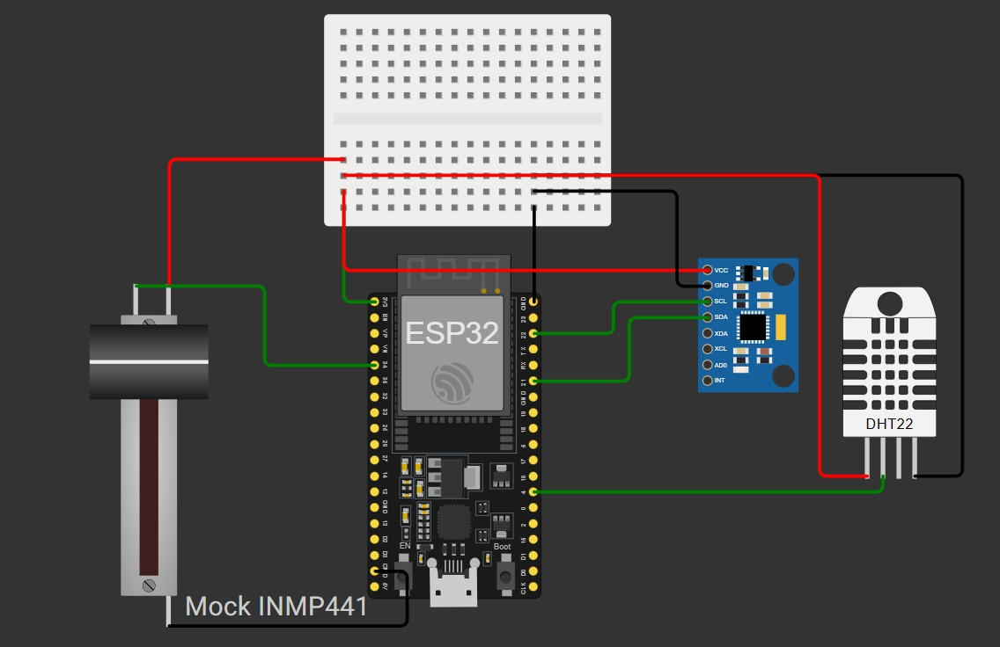
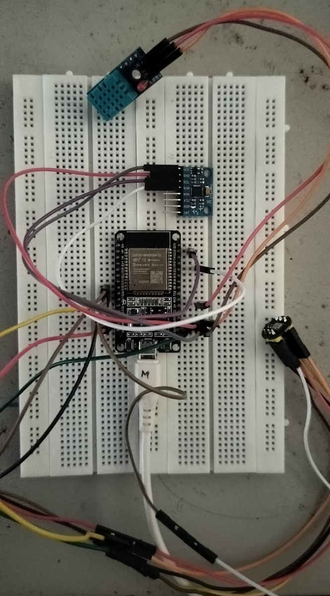

# Smart Cradle: An IoT-Based Child Safety and Monitoring System

---

## 📌 Introduction
The **Smart Cradle** is an IoT-powered child monitoring and safety system designed to ensure the well-being of infants. It integrates **sensors, machine learning, and cloud-based visualization** to detect abnormal cradle movements, environmental conditions, and crying patterns.  

Our system continuously monitors the infant’s environment and sends alerts to caregivers in case of unsafe conditions such as:
- Abnormal shaking/tilting  
- Loud crying or continuous crying  
- Unfavorable environmental conditions (temperature, humidity, motion, air quality)  

This helps parents and caregivers **reduce risks like overheating, unattended crying, and unsafe rocking** while ensuring a safer and more comfortable environment for infants.  

---

## 🌐 Deployed Links
- **Website (Visualization Dashboard):** [Smart Cradle Web App](https://smart-cradle-fbb4a.web.app/visualisation)  
- **Edge Impulse ML Model:** [Smart Cradle Model](https://studio.edgeimpulse.com/studio/775757)  

---

## ⚙️ Features
- Real-time monitoring of infant safety and comfort  
- Machine Learning model for classifying crying patterns  
- IoT-enabled notifications via **Blynk Cloud & Firebase**  
- Alerts through **SMS / Email / Telegram** (unsafe rocking, excessive crying, etc.)  
- Web dashboard for **live visualization** of cradle status  

---

## 🛠️ Hardware Components

| Component          | Purpose                                                                 |
|--------------------|-------------------------------------------------------------------------|
| **ESP32**          | Main microcontroller with Wi-Fi, processes sensor data & triggers alerts |
| **MPU6050**        | Detects motion, tilt, and vibration (cradle movements)                  |
| **DHT11**          | Monitors temperature and humidity                                       |
| **INMP441**        | I²S microphone for accurate sound capture                               |
| **Buzzer / LED**   | Provides local feedback (alerts)                                        |
| **Breadboard**     | Connects components for prototyping                                     |
| **Power Supply & Wires** | Powers the system and connects components                     |

---

## 🔌 Wiring Connections

### Power Rails
| From (ESP32) | To (Breadboard) |
|--------------|-----------------|
| 3V3          | +V rail         |
| GND          | GND rail        |

---

### MPU6050 (I²C Accelerometer + Gyro)
| Pin (MPU6050) | Connected To          | Notes |
|---------------|-----------------------|-------|
| VCC           | 3V3                   | Power |
| GND           | GND                   | Ground |
| SDA           | GPIO21 (SDA) on ESP32 | I²C Data |
| SCL           | GPIO22 (SCL) on ESP32 | I²C Clock |
| AD0 *(opt.)*  | GND                   | Keeps default I²C address (0x68) |
| INT *(opt.)*  | Not connected         | Use free GPIO if needed |

---

### DHT11 (Temperature + Humidity)
| Pin (DHT11) | Connected To | Notes |
|-------------|--------------|-------|
| VCC         | 3V3          | Works on 3–5V, 3.3V is fine |
| GND         | GND          | Ground |
| DATA        | GPIO4        | Matches `#define DHTPIN 4` in code |
| —           | 3V3 (via 4.7kΩ pull-up) | Pull-up resistor between DATA and 3V3 |

---

### LED Indicator
| Pin (LED)   | Connected To        | Notes |
|-------------|---------------------|-------|
| Anode (+)   | GPIO2 (via 220Ω R)  | Series resistor required |
| Cathode (–) | GND                 | Ground |

---

### INMP441 (I²S Microphone)
| Pin (INMP441) | Connected To | Notes |
|---------------|--------------|-------|
| VDD           | 3V3          | **Never use 5V** |
| GND           | GND          | Ground |
| L/R (LR)      | GND          | Left channel / Mono |
| WS (LRCLK)    | GPIO25       | I²S Word Select |
| SCK (BCLK)    | GPIO26       | I²S Bit Clock |
| SD (DOUT)     | GPIO33       | I²S Data Out |

---

## 🖥️ Software Stack
- **Firmware:** ESP32 (Arduino IDE / MicroPython)  
- **ML Model:** Edge Impulse (cry detection & unsafe rocking detection)  
- **Cloud:** Firebase, Blynk Cloud  
- **Frontend:** Deployed website for visualization  

---

## 🚀 Future Enhancements
- Integration of camera module for real-time monitoring  
- Advanced ML models for emotion & gesture detection  
- Mobile app for caregiver alerts  

---

## 📐 Circuit & Prototype

Here is the circuit diagram of the Smart Cradle system:  

  

---

## 📊 Budget (Approx.)

| Item                          | Cost (INR) |
|-------------------------------|-----------|
| ESP32                         | ₹589      |
| MPU6050                       | ₹165      |
| DHT11                         | ₹118      |
| 3.7V Rechargeable Battery     | ₹90       |
| TP4056 Charging Module        | ₹15       |
| INMP441 Microphone            | ₹334      |
| RGB LED                       | ₹10       |
| Others (Wires, Breadboard, Buzzer) | ₹260 |
| **Total**                     | **₹1581** |

---

## 👨‍💻 Team
- **Sri Charan A**  
- **Navaneeth A B S**  
- **Madhavan S K R**  

---
